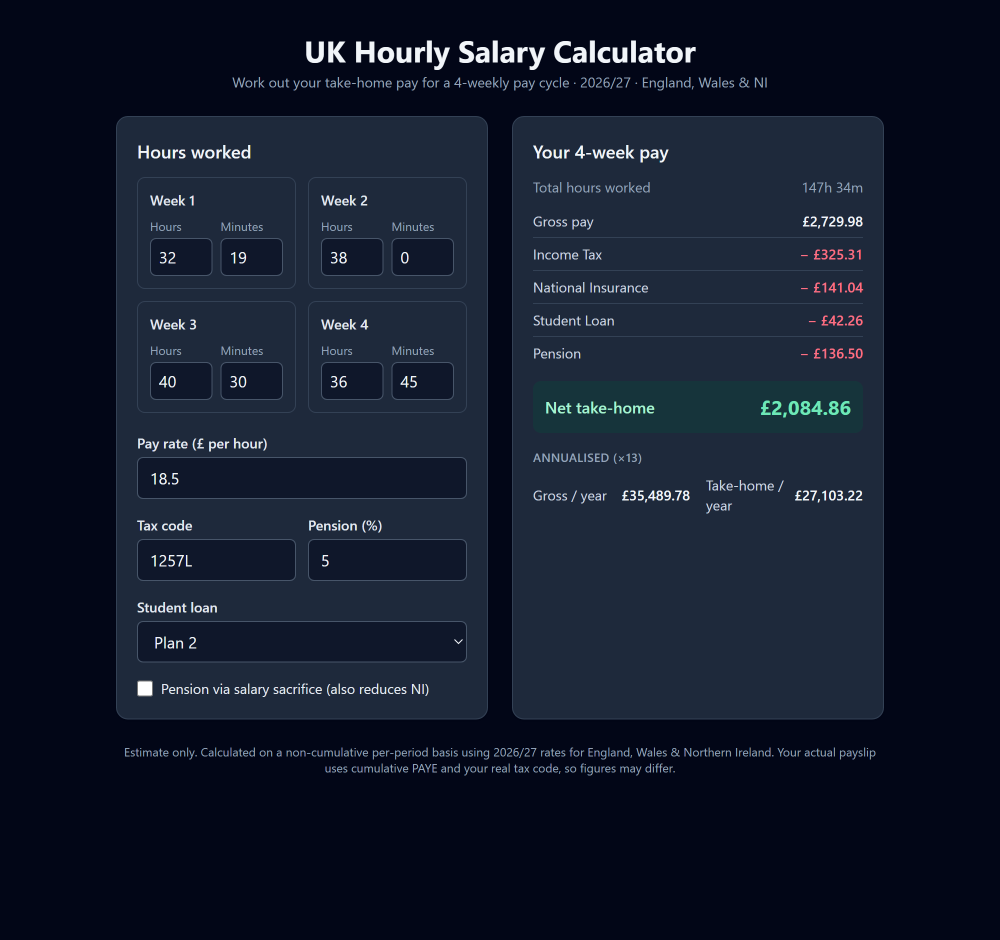

# UK Hourly Salary Calculator

**🔗 Live demo: https://monthly-salary-calculator-pearl.vercel.app/**

A small web app for working out take-home pay when you're paid **hourly on a 4-weekly
cycle** (13 pay periods a year) rather than a fixed monthly salary.

Enter the **hours and minutes** you worked for each of the 4 weeks plus your **hourly
rate**, and it shows your **gross pay** and your **net (take-home) pay** after Income
Tax, National Insurance, and optionally Student Loan and Pension.



## Features

- Hours + minutes input for each of the 4 weeks in the pay period
- Gross pay and a full deduction breakdown → net take-home
- Income Tax via your **tax code** (e.g. `1257L`)
- Employee **National Insurance**
- **Student Loan** (Plan 1 / 2 / 4 / 5 / Postgraduate)
- **Pension** contribution, with an optional **salary-sacrifice** mode (also reduces NI)
- Annualised (×13) summary
- Live recalculation as you type

## Tech stack

React + Vite + TypeScript, styled with Tailwind CSS. The calculation logic lives in a
pure, framework-free module (`src/lib/`) with Vitest unit tests, kept separate from the UI.

## Getting started

```bash
npm install
npm run dev      # start the dev server (http://localhost:5173)
npm test         # run the unit tests
npm run build    # type-check and build for production
```

## How it works

Salary is calculated on a **non-cumulative, per-period basis**: each annual threshold
(personal allowance, NI thresholds, student-loan thresholds, tax bands) is scaled to a
single 4-weekly period (×4/52, i.e. ÷13) and applied to that period's pay. This is how
NI and Student Loan genuinely work each period, and approximates HMRC's Week 1/Month 1
PAYE basis.

All tax rates and thresholds live in a single file, **`src/lib/taxConfig.ts`** — to
update for a new tax year, only the numbers there need changing.

## Assumptions & caveats

- **Estimate only.** A real payslip uses cumulative PAYE against your actual tax code,
  so figures may differ slightly.
- **Tax year 2026/27**, **England, Wales & Northern Ireland** rates.
- Scotland's separate income-tax bands and special tax codes (K / BR / D0 / NT) are not
  modelled (the calculator falls back to the standard allowance for unrecognised codes).
- A single pay rate is assumed (no separate overtime multipliers).

Rates sourced from GOV.UK:
[employer rates & thresholds 2026/27](https://www.gov.uk/guidance/rates-and-thresholds-for-employers-2026-to-2027)
and [student loan terms 2026/27](https://www.gov.uk/government/publications/student-loans-a-guide-to-terms-and-conditions/student-loans-a-guide-to-terms-and-conditions-2026-to-2027).
